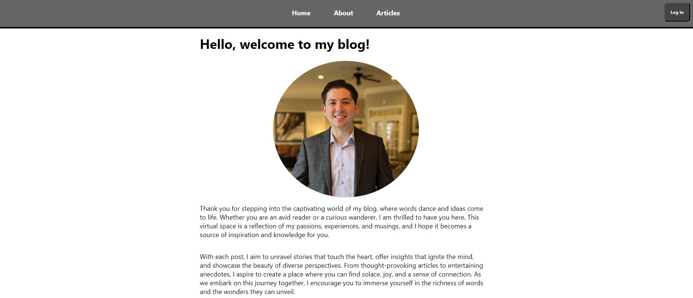

# Full-Stack Blog App

Welcome to the Full-Stack Blog App! This is a web application built using React for the front end, Node.js and Express.js for the back end development and API implementation, MongoDB for the database, Firebase for Authentication, and Google Cloud for hosting.

## Table of Contents

- [Full-Stack Blog App](#full-stack-blog-app)
  - [Table of Contents](#table-of-contents)
  - [Features](#features)
  - [Description](#description)
  - [Sapshots](#sapshots)
    - [Home Page](#home-page)
    - [Articles List Page](#articles-list-page)
    - [Article Page](#article-page)
  - [Installation](#installation)

## Features


- User registration and authentication with Firebase
- Like and comment on blog posts
- Responsive and user-friendly UI
- Secure data storage with MongoDB
- Scalable and reliable hosting with Google Cloud


## Description

Full application stored on this GIT repository, blog-app beign the front end and blog-app-backend being the back-end.
Server API implementation located at [Path to server file](/blog-app-backend/src/server.js)

This application let any user sign up for the app to be able to add upvotes and create comments to the different blog posts. This authentication is build using Google Firebase API.

Site is created using REACT for Front-End Development, NodeJS and ExpressJS for Back-End and API Development.

The site is beign hosted by the Google Cloud Platform and can be accesible anywhere using this link: [Full Stack React Blog App](https://react-blog-a5f95.ue.r.appspot.com/)

## Sapshots

### Home Page


### Articles List Page


### Article Page


## Installation

To run this application locally, you need to have Node.js and npm installed on your machine. Clone this repository and follow the steps below:

1. Install the required npm packages for the front end and back end:

```bash
cd blog-app
npm install

cd ../blog-app-backend
npm install
npm install -g firebase-tools

global
install Google Cloud CLI, for Windows: https://cloud.google.com/sdk/docs/downloads-versioned-archives.


<!-- # Full-Stack Blog App

## Created using the following technologines:


- REACT for Front-End development.
- NodeJS and ExpressJS for Back-End development and API.
- MongoDB as database.
- Firebase for user Authentication.
- Google Cloud for Hosting.

## Description

####  -->


